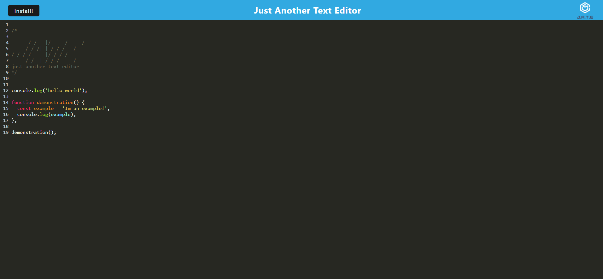

# Code Editor

## Description
This application is a PWA code/text editor that uses webpack and workbox to build a text editor that runs in the browser. 

## Installation
This applicaiton uses a lot of dependancies including webpack and workbox. To install the dependancies run npm install from the root directory of the application

## Usage 
Once the dependancies are installed, run nmp start from the command line in the root directory of the project. This will build the dist directory which will be in the client directory, and will start the server (the localhost server for this application runs on port 3020). Open the browser and visit the URL localhost:3020 to veiw and test the application out! You can also click the install button in the application to install the application locally. Here is a link to the deployed version of the app on Heroku:

[Code Editor](https://morning-peak-35135.herokuapp.com/)

Here is an image of the deployed application:

## Contributing
Made by Samuel Varney